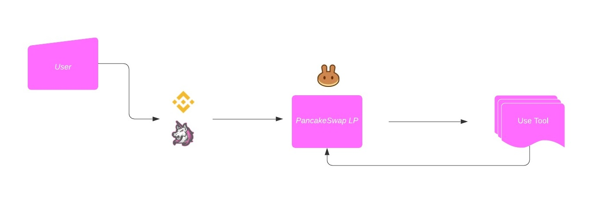

# Liquidity Staking

Liquidity staking to borrow tools is a new concept. It empowers users to freely borrow useful blockchain tools and at the same time provide liquidity to the pool for Pegasus. In order to use our tools users will have to purchase some PEG tokens as well as BNB. Once these assets are in your wallet you can migrate over to Pancakeswap and stake liquidity in exchange for BNB-PEG LP tokens. Finally these LP tokens will be used as a login mechanism for our future tools allowing you the freedom to unstake at anytime you are finished with them. Once finished you can head back over to pancakeswap and exchange the LP tokens back into PEG and BNB to hold, sell or use again at a later date.   

